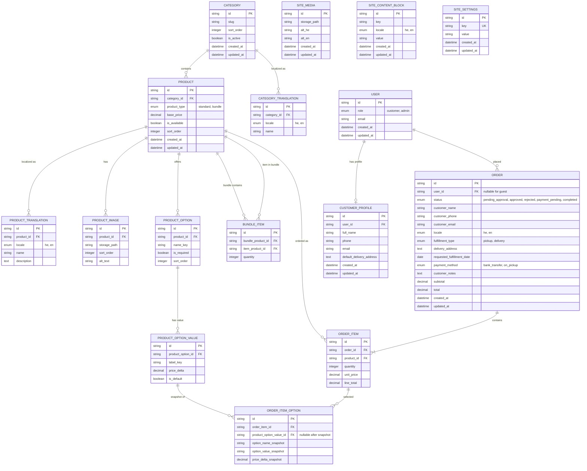

# ERD: Maison Malka

Version: MVP v1.0  
Status: Draft — pending review  
Source PRD: `DOCS/Maison-Malka-PRD.md`  
Source Architecture: `DOCS/Maison-Malka-Architecture-Plan.md`

---

## 1. Overview

Maison Malka is a transactional e-commerce data model for a premium pastry shop. The core persistent data covers a categorized product catalog (including fixed bundles and basic options), optional customer accounts, order requests with manual approval, and admin-managed content in Hebrew and English. Shopping cart state for guests is handled at application/session level until checkout creates an `Order`.

---

## 2. Mermaid Diagram

---

## 3. Entities

### Category

**Purpose:** Groups products in the catalog (e.g., cakes, bundles).  
**Source:** PRD §7 (קטלוג לפי קטגוריות), PRD §13 (קטגוריות ב-MVP)

| Field | Type | Required | Notes |
|-------|------|----------|-------|
| id | string | yes | Primary key |
| slug | string | yes | Unique URL identifier |
| sort_order | integer | yes | Display order |
| is_active | boolean | yes | Admin can hide category |
| created_at | datetime | yes | |
| updated_at | datetime | yes | |

### CategoryTranslation

**Purpose:** Localized category names (Hebrew / English).  
**Source:** PRD §10 (שפות), PRD §7 (קטלוג)

| Field | Type | Required | Notes |
|-------|------|----------|-------|
| id | string | yes | Primary key |
| category_id | reference: Category | yes | |
| locale | enum: [he, en] | yes | Unique per category |
| name | string | yes | |

### Product

**Purpose:** Sellable catalog item — standard product or fixed bundle.  
**Source:** PRD §7 (עמודי מוצר, מארזים קבועים), Architecture §6

| Field | Type | Required | Notes |
|-------|------|----------|-------|
| id | string | yes | Primary key |
| category_id | reference: Category | yes | |
| product_type | enum: [standard, bundle] | yes | Bundle = מארז קבוע |
| base_price | decimal | yes | Price before option deltas |
| is_available | boolean | yes | Manual availability toggle |
| sort_order | integer | yes | Within category |
| created_at | datetime | yes | |
| updated_at | datetime | yes | |

### ProductTranslation

**Purpose:** Localized product name and description.  
**Source:** PRD §10 (שפות), PRD §7 (תמונות ותיאורים)

| Field | Type | Required | Notes |
|-------|------|----------|-------|
| id | string | yes | Primary key |
| product_id | reference: Product | yes | |
| locale | enum: [he, en] | yes | Unique per product |
| name | string | yes | |
| description | text | yes | |

### ProductImage

**Purpose:** Image reference stored in external object storage (Supabase Storage).  
**Source:** PRD §7 (תמונות), Architecture §6, Technology Stack §8

| Field | Type | Required | Notes |
|-------|------|----------|-------|
| id | string | yes | Primary key |
| product_id | reference: Product | yes | |
| storage_path | string | yes | File reference, not binary in DB |
| sort_order | integer | yes | Gallery order |
| alt_text | string | no | Accessibility |

### ProductOption

**Purpose:** Basic variation on a product (e.g., size).  
**Source:** Architecture §6 (basic variations), PRD §8 (no complex customization)

| Field | Type | Required | Notes |
|-------|------|----------|-------|
| id | string | yes | Primary key |
| product_id | reference: Product | yes | Not used on bundle products |
| name_key | string | yes | i18n key or admin label reference |
| is_required | boolean | yes | |
| sort_order | integer | yes | |

### ProductOptionValue

**Purpose:** Selectable value for a product option with optional price change.  
**Source:** Architecture §6 (price changes based on options)

| Field | Type | Required | Notes |
|-------|------|----------|-------|
| id | string | yes | Primary key |
| product_option_id | reference: ProductOption | yes | |
| label_key | string | yes | i18n key or admin label reference |
| price_delta | decimal | yes | Added to base_price |
| is_default | boolean | yes | |

### BundleItem

**Purpose:** Defines which products compose a fixed bundle and in what quantity.  
**Source:** PRD §7 (מארזים קבועים), PRD §13 (מארזים ב-MVP)

| Field | Type | Required | Notes |
|-------|------|----------|-------|
| id | string | yes | Primary key |
| bundle_product_id | reference: Product | yes | product_type = bundle |
| item_product_id | reference: Product | yes | product_type = standard |
| quantity | integer | yes | Min 1 |

### User

**Purpose:** Authenticated identity (customer or admin) via managed auth (Supabase Auth).  
**Source:** PRD §7 (הרשמה אופציונלית), Architecture §10, §5.4 Admin User Model

| Field | Type | Required | Notes |
|-------|------|----------|-------|
| id | string | yes | Primary key, synced with auth provider |
| role | enum: [customer, admin] | yes | MVP: one admin, model supports more |
| email | string | yes | |
| created_at | datetime | yes | |
| updated_at | datetime | yes | |

### CustomerProfile

**Purpose:** Saved customer details for registered users and repeat orders.  
**Source:** PRD §9 step 9, Architecture §10 (optional registration)

| Field | Type | Required | Notes |
|-------|------|----------|-------|
| id | string | yes | Primary key |
| user_id | reference: User | yes | One profile per customer user |
| full_name | string | yes | |
| phone | string | yes | |
| email | string | yes | |
| default_delivery_address | text | no | For delivery preference |
| created_at | datetime | yes | |
| updated_at | datetime | yes | |

### Order

**Purpose:** Customer order request requiring manual admin approval before becoming final.  
**Source:** PRD §9, PRD §13 (אישור ידני), Architecture §7

| Field | Type | Required | Notes |
|-------|------|----------|-------|
| id | string | yes | Primary key |
| user_id | reference: User | no | Null for guest checkout |
| status | enum: [pending_approval, approved, rejected, payment_pending, completed] | yes | |
| customer_name | string | yes | Snapshot at order time |
| customer_phone | string | yes | Snapshot at order time |
| customer_email | string | yes | Snapshot at order time |
| locale | enum Locale | yes | Storefront language at checkout (`he` default); drives customer email language |
| fulfillment_type | enum: [pickup, delivery] | yes | |
| delivery_address | text | no | Required when delivery |
| requested_fulfillment_date | date | yes | Separate from created_at |
| payment_method | enum: [bank_transfer, on_pickup] | yes | No card storage |
| customer_notes | text | no | Basic order notes only |
| subtotal | decimal | yes | |
| total | decimal | yes | |
| created_at | datetime | yes | Order submission time |
| updated_at | datetime | yes | |

### OrderItem

**Purpose:** Line item in an order (product + quantity + price at order time).  
**Source:** PRD §9 steps 3–4, Architecture §7

| Field | Type | Required | Notes |
|-------|------|----------|-------|
| id | string | yes | Primary key |
| order_id | reference: Order | yes | |
| product_id | reference: Product | yes | |
| quantity | integer | yes | Min 1 |
| unit_price | decimal | yes | Snapshot at order time |
| line_total | decimal | yes | quantity × unit_price + options |

### OrderItemOption

**Purpose:** Snapshot of selected product options on an order line (immutable after submit).  
**Source:** Architecture §7 (selected options), PRD §8 (no complex customization)

| Field | Type | Required | Notes |
|-------|------|----------|-------|
| id | string | yes | Primary key |
| order_item_id | reference: OrderItem | yes | |
| product_option_value_id | reference: ProductOptionValue | no | Nullable after snapshot stored |
| option_name_snapshot | string | yes | |
| option_value_snapshot | string | yes | |
| price_delta_snapshot | decimal | yes | |

---

## 4. Relationships

**Category → Product:** one-to-many  
- Description: Each product belongs to one category.  
- Cascade: restrict (cannot delete category with products)  
- Source: PRD §7

**Category → CategoryTranslation:** one-to-many  
- Description: Each category has Hebrew and English names.  
- Cascade: cascade  
- Source: PRD §10

**Product → ProductTranslation:** one-to-many  
- Description: Each product has Hebrew and English content.  
- Cascade: cascade  
- Source: PRD §10

**Product → ProductImage:** one-to-many  
- Description: A product has one or more images.  
- Cascade: cascade  
- Source: PRD §7

**Product → ProductOption:** one-to-many  
- Description: Standard products may have basic options.  
- Cascade: cascade  
- Source: Architecture §6

**ProductOption → ProductOptionValue:** one-to-many  
- Description: Each option has selectable values.  
- Cascade: cascade  
- Source: Architecture §6

**Product → BundleItem (bundle side):** one-to-many  
- Description: A bundle product contains multiple bundle items.  
- Cascade: cascade  
- Source: PRD §7 (מארזים קבועים)

**Product → BundleItem (item side):** one-to-many  
- Description: A standard product can appear in multiple bundles.  
- Cascade: restrict  
- Source: PRD §7

**User → CustomerProfile:** one-to-one (optional)  
- Description: Registered customer users have one saved profile.  
- Cascade: cascade  
- Source: PRD §9 step 9

**User → Order:** one-to-many (optional)  
- Description: Registered users link to their orders; guests have null user_id.  
- Cascade: set null  
- Source: PRD §9 steps 5, 9

**Order → OrderItem:** one-to-many  
- Description: An order contains one or more line items.  
- Cascade: cascade  
- Source: PRD §9

**Product → OrderItem:** one-to-many  
- Description: Products are referenced on order lines with price snapshot.  
- Cascade: restrict  
- Source: PRD §9

**OrderItem → OrderItemOption:** one-to-many  
- Description: Line items store selected options as immutable snapshots.  
- Cascade: cascade  
- Source: Architecture §7

---

## 4b. Site Content CMS (Phase 6)

### SiteMedia

**Purpose:** Marketing / site images in Storage bucket `site-media` (not product catalog).  
**Source:** `team-Yuri/arch-phase6.md`

| Field | Type | Required | Notes |
|-------|------|----------|-------|
| id | string | yes | Primary key |
| storage_path | string | yes | Path in `site-media` bucket |
| alt_he | string | yes | Hebrew alt text |
| alt_en | string | yes | English alt text |
| created_at | datetime | yes | |
| updated_at | datetime | yes | |

### SiteContentBlock

**Purpose:** Allowlisted plain-text CMS keys per locale; image slots use locale `he` and store `SiteMedia.id` in `value`.  
**Source:** `team-Yuri/arch-phase6.md`, `manager-phase6.md`

| Field | Type | Required | Notes |
|-------|------|----------|-------|
| id | string | yes | Primary key |
| key | string | yes | Allowlisted key |
| locale | enum: [he, en] | yes | Unique with key |
| value | string | yes | Plain text or media id |
| created_at | datetime | yes | |
| updated_at | datetime | yes | |

### SiteSettings

**Purpose:** Locale-agnostic business settings (phone, address, hours, lead-time note, bank transfer details).  
**Source:** `team-Yuri/arch-phase6.md`, extended in Phase 7 (`bank_transfer_details`)

| Field | Type | Required | Notes |
|-------|------|----------|-------|
| id | string | yes | Primary key |
| key | string | yes | Unique allowlisted key (`pickup_address`, `phone`, `business_hours`, `lead_time_note`, `bank_transfer_details`) |
| value | string | yes | Plain text (multiline OK for bank details) |
| created_at | datetime | yes | |
| updated_at | datetime | yes | |

---

## 5. Coverage Map

| PRD Reference | Capability | Entities Involved |
|---------------|------------|-------------------|
| PRD §9 step 1 | Guest browses without login | — (⚠️ UI/session only) |
| PRD §9 step 2 | Browse products | Category, CategoryTranslation, Product, ProductTranslation, ProductImage |
| PRD §9 step 3 | Select products | Product, ProductOption, ProductOptionValue, BundleItem |
| PRD §9 step 4 | Add to cart | — (⚠️ session/client cart until checkout) |
| PRD §9 step 5 | Fill details at checkout | Order (customer snapshot fields) |
| PRD §9 step 6 | Pickup / delivery | Order.fulfillment_type, Order.delivery_address |
| PRD §9 step 7 | Payment method selection | Order.payment_method |
| PRD §9 step 8 | Order request + pending approval | Order, OrderItem, OrderItemOption |
| PRD §9 step 9 | Optional registration | User, CustomerProfile |
| PRD §7 admin | Manage products | Product, ProductTranslation, ProductImage, ProductOption, ProductOptionValue |
| PRD §7 admin | Manage categories | Category, CategoryTranslation |
| PRD §7 admin | Manage bundles | Product (bundle), BundleItem |
| PRD §7 admin | Availability toggle | Product.is_available |
| PRD §7 admin | Orders list + calendar | Order (query by requested_fulfillment_date and created_at) |
| PRD §13 | Manual approval | Order.status |
| PRD §10 | Hebrew + English | CategoryTranslation, ProductTranslation |
| PRD §8 out | Inventory automation | — (not modeled) |
| PRD §8 out | Loyalty / coupons | — (not modeled) |
| PRD §8 out | Seasonal products | — (not modeled) |
| Phase 6 CMS | Site marketing content / media / settings | SiteMedia, SiteContentBlock, SiteSettings |
| Phase 7 Trust & Legal | Bank transfer instructions in settings | SiteSettings (`bank_transfer_details`) |

---

## 6. Open Questions

- **Cart persistence:** MVP cart is modeled as session/client state until checkout. If server-side cart persistence is required later, add `Cart` + `CartItem` entities in a future revision.
- **ProductOption i18n:** Options use `name_key` / `label_key` — implementation may use translation tables or app-level i18n files. Physical i18n strategy is an implementation detail, not ERD scope.

---

## 7. Explicitly Not Modeled (MVP)

Per PRD Out of Scope and Architecture decisions:

- Inventory / stock levels
- Payment transactions or card data
- Email notification log (Resend is external)
- Loyalty, coupons, CRM
- Seasonal product scheduling
- Production planning

---

**ERD location:** `DOCS/Maison-Malka-ERD.md` (canonical — do not duplicate)
